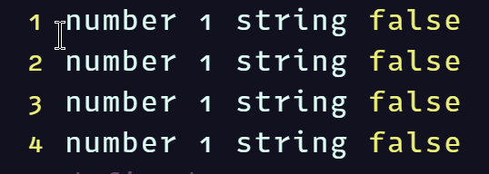
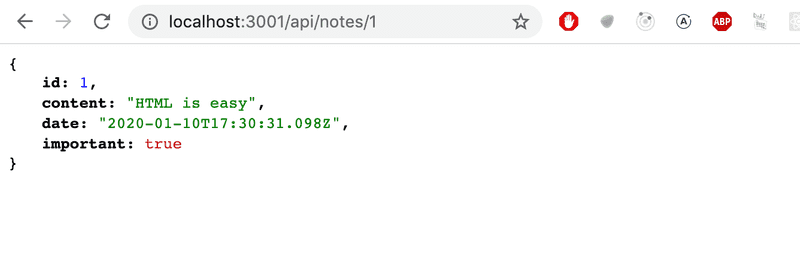
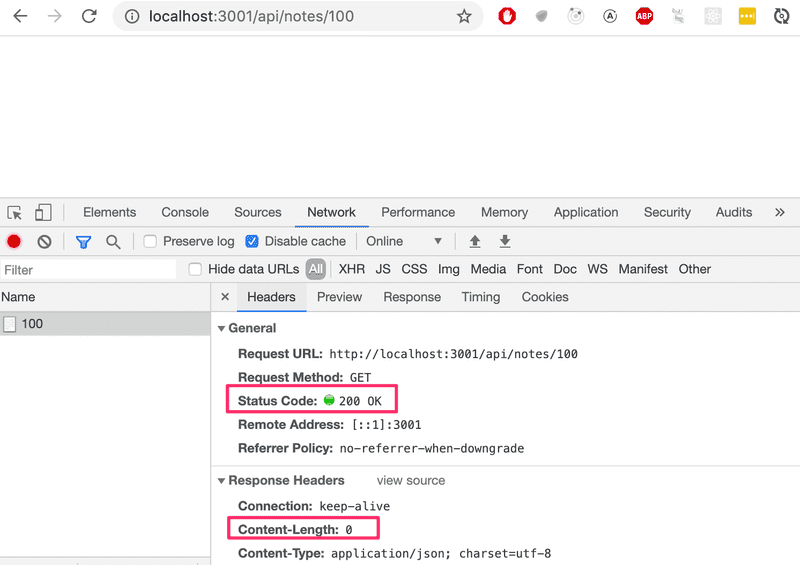
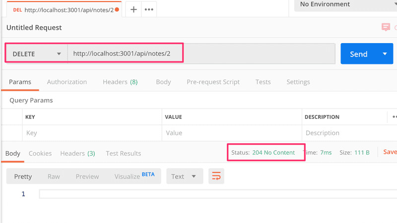

# Node.js and Express

- [Node.js and Express](#nodejs-and-express)
  - [Simple Web Server](#simple-web-server)
  - [Expess](#expess)
  - [Web and Express](#web-and-express)
  - [Nodemon](#nodemon)
  - [REST](#rest)
  - [Fetching a Single Resource](#fetching-a-single-resource)
  - [Deleting Resources](#deleting-resources)
  - [Postman](#postman)

- Make a folder

```sh
mkdir backend && cd backend
npm init
```

- Create index.js file with below content:

```sh
echo "console.log('hello world')" > index.js
```

- Add script to package.json:

```json
"start": "node index.js"
```

- We can run the program directly:

```sh
node index.js
```

- Or we can run it as:

```sh
npm start
```

## Simple Web Server

Let's change the app into a web server:

```js
const http = require("http") // Node's built-in web server module

const app = http.createServer((req, res) => {
  res.writeHead(200, { "Content-Type": "text/plain" })
  res.end("Hello World")
})

const PORT = 3001
app.listen(PORT)
console.log(`Server running on port ${PORT}`)
```

- run **`npm start`** to start the server & visit http://localhost:3001
- The address http://localhost:3001/foo/bar will display the same content.

To serve raw data in the JSON format to the frontend we can do this:

```js
const http = require("http")

let notes = [
  {
    id: 1,
    content: "HTML is easy",
    date: "2019-05-30T17:30:31.098Z",
    important: false,
  },
  ...
]

const app = http.createServer((req, res) => {
  res.writeHead(200, { "Content-Type": "application/json" })
  res.end(JSON.stringify(notes))
})

const PORT = 3001
app.listen(PORT)
console.log(`Server running on port ${PORT}`)
```

## Expess

**Express** is an interface to work with built-in **http** module. It provides a better abstraction for general use cases we usually require to build a backend server.

```sh
npm install express
```

- To update the dependencies of our project we can:

```sh
npm update
```

## Web and Express

```js
const express = require('express')
const app = express()

let notes = [
  ...
]

app.get('/', (request, response) => {
  response.send('<h1>Hello World!</h1>')
})

app.get('/api/notes', (request, response) => {
  response.json(notes)
})

const PORT = 3001
app.listen(PORT, () => {
  console.log(`Server running on port ${PORT}`)
})
```

We define two *routes* to the app. The event handler function accepts two parameters: **`request`** and **`response`**. **`request`** contains all of the info of the HTTP request, **`response`** parameters is used to define how the request is responded to.

The request to the app's root (**`/`**) is answered by using the **`send`** method of the **`response`** object. Server responds with the string **`<h1>Hello World!</h1>`**, that was passed to the **`send`** method. Since the parameter is a string, express automatically sets the value of the **`Content-Type`** header to be **`text/html`**. The status code of the response defaults to **`200`**.


The second route defines an event handler, that handles **HTTP GET** request made to the **_notes_** path of the application.

The request is responded to with the **`json`** method of the **`response`** object. **`Content-Type`** is automatically set to **`application/json`**.

In the earlier version where we were only using Node, we had to transform the data into the JSON format with the **`JSON.stringify`** method.

```js
response.end(JSON.stringify(notes))
```

With Express, this transformation happens automatically.

## Nodemon

> nodemon will watch the files in the directory in which nodemon was started, and if any files change, nodemon will autumatically restart your node application.

```sh
# npm install --save-dev nodemon
```

We can start our application with **_nodemon_** like this:

```sh
node_modules/.bin/nodemon index.js
```

Even though the backend server restarts automatically, the browser still has to be manually refreshed.

Let's define a dedicated **_npm script_** for it in the **_package.json_** file:

```json
"scripts": {
  "start": "node index.js",
  "dev": "nodemon index.js",
}
```

Start the server in the dev mode:

```sh
npm run dev
```

## REST

Singular things, like notes, persons, tasks, are called **_resources_** in RESTful thinking. Every resource has an associated URL, which is the resource's unique address.

One convention is to create the unique address for the resources by combining the name of the resource type with the resource's unique identifier.

If the root URL of our service is **_www.example.com/api_** & we define the resource type of notes to be **_note_**, then the address of a note resource with the identifier 10, has the unique address **_www.example.com/api/notes/10_**.

The URL for the entire collection of note resources is **_www.example.com/api/notes_**.

We can execute different operations on resources. The operation to be executed is defined by the HTTP verb:


| URL            | Verb         | Functionality                                                    |
| -------------- | ------------ | ---------------------------------------------------------------- |
| **`notes/10`** | **`GET`**    | fetches a single resource                                        |
| **`notes`**    | **`GET`**    | fetches all resources in the collection                          |
| **`notes`**    | **`POST`**   | creates a new resource based on the request data                 |
| **`notes/10`** | **`DELETE`** | removes the identified resource                                  |
| **`notes/10`** | **`PUT`**    | replaces the entire identified resource with the request data    |
| **`notes/10`** | **`PATCH`**  | replaces a part of the identified resource with the request data |

## Fetching a Single Resource

- Let's create a route for fetching a single resource

```js
app.get("/api/notes/:id", (req, res) => {
  const id = req.params.id
  const note = notes.find((note) => note.id === id)
  res.json(note)
})
```

- Now **`app.get("api/notes/:id", ...)`** will handle all HTTP GET requests, that are of the form **_/api/notes/SOMETHING_**, where *SOMETHING* is an arbitrary string.

- The **_id_** parameter in the route of a request, can be accessed through the **`req`** object:

```js
const id = request.params.id
```

- **`find`** method of arrays is used to find the note with an id that matches the parameter. The note is then returned to the sender of the request.

- When we test our app by visiting http://localhost:3001/api/notes/1, we notice that it does not appear to work, as the browser displays an empty page.

- Let's debug using **`console.log()`**:

```js
app.get("/api/notes/:id", (req, res) => {
  const id = req.params.id
  console.log(id)
  const note = notes.find((note) => note.id === id)
  console.log(note)
  res.json(note)
})
```

- When we revisit http://localhost:3001/api/notes/1, the console which is the terminal in this case, will display the following:


- The **`id`** parameter from the route is passed to our app but the **`find`** method does not find a matching note.

- To further our investigation, we can also add a **`console.log`** inside the comparison function passed to the **`find`** method.

```js
app.get("/api/notes/:id", (req, res) => {
  const id = req.params.id
  const note = notes.find((note) => {
    console.log(note.id, typeof note.id, id, typeof id, note.id === id)
    return note.id === id
  })
  console.log(note)
  res.json(note)
})
```

When we visit the URL again, each call to the comparison function prints a few different things to the console.



The **`id`** variable contains a string **`"1"`**, wheres the ids of notes are integers. In JS, the "triple equals" comparison **`===`** considers all values of different types to not be equal by default, meaning that **`1`** is not **`"1"`**.

- Let's fix the issue by changing id parameter from a string into a number:

```js
app.get("/api/notes/:id", (req, res) => {
  const id = Number(req.params.id)
  const note = notes.find((note) => note.id === id)
  res.json(note)
})
```

- Now fetching an individual resource works.



However, there's another problem. If we search for a note with an id that does not exist, the server responds with:



HTTP status code **`200`** means that the response succeeded. But there's no data sent back.

The reason for this is that the **`note`** variable is set to **`undefined`** if no mathing note is found. The situation needs to be handled on the server. If no note is found, the server should respond with the status code **`404`** not found instead of **`200`**.

```js
app.get("/api/notes/:id", (req, res) => {
  const id = Number(req.params.id)
  const note = notes.find((note) => note.id === id)

  if (note) {
    res.json(note)
  } else {
    res.status(404).end()
  }
})
```

Since no data is attached to the response, we use the [status](http://expressjs.com/en/4x/api.html#res.status) method for setting the status, and the [end](http://expressjs.com/en/4x/api.html#res.end) method for responding to the request without sending any data.

```js
res.status(403).end()
res.status(400).send('Bad Request')
res.status(404).sendFile('/absolute/path/to/404.png')
```

We do not actually need to display anything in the browser because REST APIs are interfaces that are intended for programmatic use, and the error status code is all that is needed.

## Deleting Resources

Deletion happens by making an HTTP **`DELETE`** request to the url of the resource:

```js
app.delete("/api/notes/:id", (req, res) => {
  const id = Number(req.params.id)
  notes = notes.filter((note) => note.id !== id)

  res.status(204).end()
})
```

If deleting the resource is successful, meaning that the note exists and it is removed, we respond to the request with the status code **`204`** no content and return no data with the response. We can also respond with **`404`**.

## Postman

**`HTTP GET`** requests are easy to make from the browser. But how do we test the **`delete`** operations? We could write some JS for testing deletion, but this is not always the best solution.

One method is to use a command line program [curl](https://curl.haxx.se/). However it's easier to use Postman.

It's enough to define the url and then select the correct request type (**`DELETE`**).



